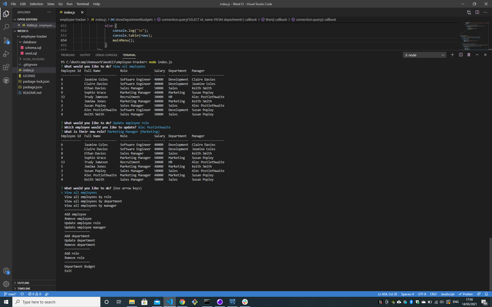

# Employee Tracker 

## Description
Creating an application in node.js using the inquirer npm to query a database with three tables in mySQL. Using this method, I was to create an application that allowed an employer to keep track of his employees, ie where they worked, who was their manager, what was their salary etc.  It also enabled the employer to update, add and delete from the database, as well as see budgets per department. 

## Table of Contents
  - [Employee Tracker](#employee-tracker)
  - [Description](#description)
  - [Table of Contents](#table-of-contents)
  - [Installation](#installation)
  - [Usage](#usage)
  - [License](#license)
  - [Contributors](#contributors)
  - [Technologies Used](#technologies-used)
  - [Future versions](#future-versions)

## Installation
Initiate the app by opening the terminal, and running npm install, followed by node index.js

## Usage
Follow the prompts in the terminal and select from the menus that are presented to you to query the database as you see fit.

A screenshot 

Video of the application in use:

[video link](https://drive.google.com/file/d/13UYbYlhI3aWNIWkWd4mKHETiawh8v55Q/view?usp=sharing)

## License
License with MIT

## Contributors
This app is the sole work of [Claire Davies](https://github.com/ClaireMDavies)

## Technologies Used
- Javascript
- node.js
- inquirer npm
- mySQL npm
- console.table npm
- mySQL Workbench
    

## Future versions
Whilst creating the functionality that was required for this project, I would like to take this further, and create a more robust application.  Such as:

- ensuring the menus presented to the user do not include their present role when updating an employee role
- ensuring the data submitted in adding a salary in role is in the correct format
- restrict employee managers to same department
- restrict managers to those in certain roles
 
  